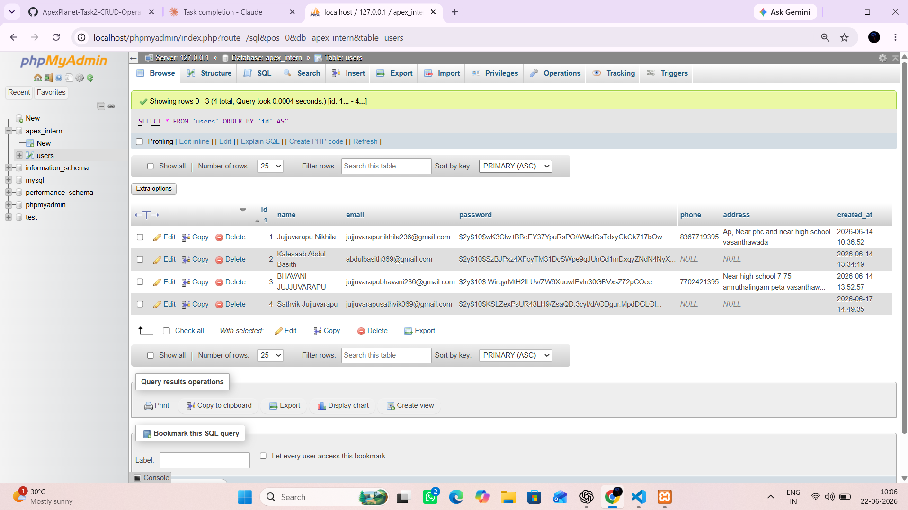
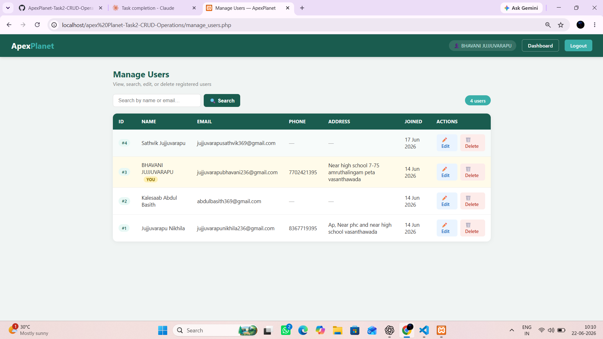
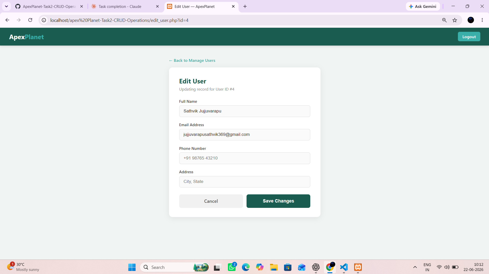
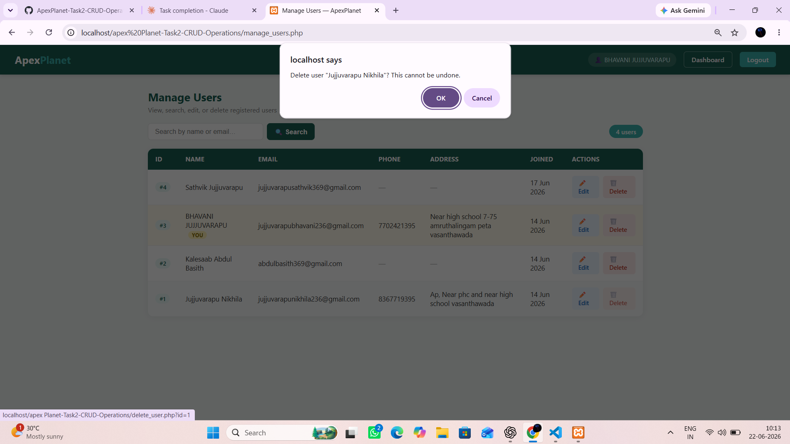
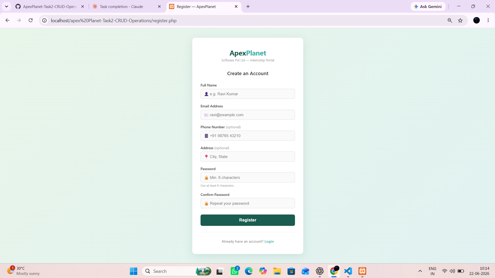

# ApexPlanet-Task2-CRUD-Operations

A PHP & MySQL web application implementing full **CRUD (Create, Read, Update, Delete)** functionality for user management — built as part of the **ApexPlanet Software Pvt. Ltd. 30-Day Web Development Internship (Task 2)**. Builds on top of Task 1's authentication system.

---


## 🛠 Tech Stack

- PHP (MySQLi, Prepared Statements)
- MySQL
- HTML5 / CSS3
- XAMPP / WAMP

---

## 📁 Project Structure

```
task2/
├── db.php             # MySQL database connection
├── setup.sql          # SQL script to create database & table (with phone/address)
├── register.php       # User registration (Create Operation — extended fields)
├── login.php          # User login page
├── dashboard.php      # Protected dashboard (session required)
├── manage_users.php   # Read Operation — view all users in a table
├── edit_user.php      # Update Operation — edit user details
├── delete_user.php    # Delete Operation — remove a user
├── logout.php         # Destroys session and redirects
└── README.md          # Project documentation
```

---

## ⚙️ Setup Instructions

### 1. Install XAMPP / WAMP
Download and install [XAMPP](https://www.apachefriends.org/) or [WAMP](https://www.wampserver.com/) and start **Apache** and **MySQL** services.

### 2. Clone / Copy Project
Place the project folder inside your server root:
- **XAMPP:** `C:/xampp/htdocs/task2/`
- **WAMP:** `C:/wamp64/www/task2/`

### 3. Create the Database
1. Open your browser and go to `http://localhost/phpmyadmin`
2. Click **SQL** in the top menu
3. Paste the contents of `setup.sql` and click **Go**

This will create:
- Database: `apex_intern`
- Table: `users` with columns → `id`, `name`, `email`, `password`, `phone`, `address`, `created_at`

> ⚠️ If you already created the `users` table in Task 1 (without `phone`/`address`), uncomment and run the two `ALTER TABLE` lines at the bottom of `setup.sql` instead of recreating the table.

### 4. Configure Database Credentials
Open `db.php` and update if needed:
```php
define('DB_USER', 'root');   // your MySQL username
define('DB_PASS', '');       // your MySQL password (blank by default in XAMPP)
```

### 5. Run the Application
Open your browser and visit:
```
http://localhost/task2/register.php
```
After logging in, click **"Manage Users"** in the dashboard navbar to access CRUD operations.

---

## 🚀 Features

| Feature | Details |
|---|---|
| User Registration | Captures name, email, phone, address, password |
| Password Hashing | Uses PHP `password_hash()` with BCRYPT |
| Email Uniqueness | Prevents duplicate registrations (checked on both register & edit) |
| User Login | Authenticates via `password_verify()` |
| Session Management | Stores user info in `$_SESSION` |
| **Create** | Extended registration form stores phone & address |
| **Read** | `manage_users.php` lists all users in a responsive table |
| **Update** | `edit_user.php` lets you edit name, email, phone, address |
| **Delete** | One-click delete with JS confirmation prompt + named success message |
| **Search** | Live search box filters users by name or email |
| **Pagination** | User list paginates 5 per page, preserves search query across pages |
| **Empty State** | "No records found" message shown when a search returns nothing |
| **Self-row Highlight** | The logged-in user's own row is highlighted with a "YOU" badge |
| Protected Routes | All CRUD pages redirect to login if not authenticated |
| Logout | Destroys session cleanly |
| Input Validation | Client-side (`required`, `minlength`) + Server-side (PHP) |
| Success/Error Messages | Auto-fading toast-style messages after each action |

---

## 📸 Screenshots

### Database — phpMyAdmin `users` Table (with phone & address)


### Manage Users — Read Operation (with Search, Pagination & Self-row Highlight)


### Edit User — Update Operation


### Delete Confirmation — Delete Operation


### Registration Page — Create Operation (extended fields)


---

## 🔐 Security Highlights

- Passwords are **never stored in plain text** — hashed using `password_hash(PASSWORD_BCRYPT)`
- All user inputs are **sanitized** with `htmlspecialchars()` before display
- **Prepared statements** used for all database queries (prevents SQL injection)
- Session is properly **destroyed on logout**

---

## 👨‍💻 Author

**Name:** Abdul Basith 
**Internship at:** ApexPlanet Software Pvt. Ltd.  
**Program:** Web Development — PHP & MySQL (30 Days)  
**Task:** Task 2 — Implementing CRUD Operations
